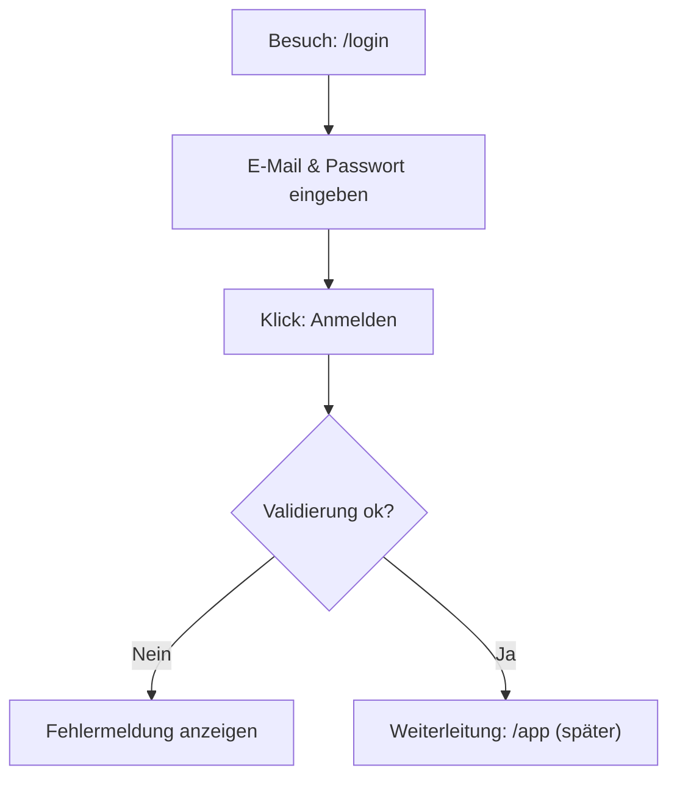

## 1. Produktübersicht
Ein Mitarbeiter-Portal für NKG Reisen mit Fokus auf sicheren Zugang und einer hochwertigen, markenkonformen Benutzeroberfläche.
Ziel ist ein zentraler Einstiegspunkt für Mitarbeitende, der künftig interne Inhalte, Tools und Prozesszugänge bündelt.

## 2. Kernfunktionen

### 2.1 Benutzerrollen
| Rolle | Anmeldemethode | Kernberechtigungen |
|------|-----------------|--------------------|
| Mitarbeiter | E-Mail + Passwort | Zugriff auf Portal nach erfolgreicher Authentifizierung |
| Admin | E-Mail + Passwort | Zugriff auf Portal mit erweiterten Rechten (späterer Ausbau) |

### 2.2 Funktionsmodule
1. **Login-Seite**: Branding-Visual links, Login-Card rechts, Demo-Zugangsdaten, „Passwort vergessen?“

### 2.3 Seitendetails
| Seitenname | Modulname | Funktionsbeschreibung |
|-----------|-----------|------------------------|
| Login | Branding-Bereich | Vollflächiger Hintergrund (848×1264) mit dunklem Overlay, Headline und Copy, NKG-Logo unten |
| Login | Login-Card | E-Mail + Passwort Eingabe, Fokus-/Fehlerzustände, „Passwort vergessen?“ Link, Anmelden-Button |
| Login | Demo-Zugangsdaten | Zwei auswählbare Demo-Profile (Mitarbeiter/Admin) mit E-Mail-Anzeige |

## 3. Kernprozess
Nutzer öffnet das Portal, sieht die Login-Seite, gibt E-Mail und Passwort ein und meldet sich an. Bei Erfolg wird künftig in den geschützten Bereich weitergeleitet; bei Fehler werden valide Fehlermeldungen angezeigt.

## 4. Benutzeroberflächen-Design
### 4.1 Designstil
- Primärfarbe/Brand-Akzent: #a19a97
- Neutralflächen: sehr helles Grau/Weiß, Card mit weichem Schatten
- Primärbutton: dunkles Navy/Blau (visuell nah am Referenzdesign), voller Radius, klare Typografie
- Typografie: moderne Sans-Serif, starke Headline-Hierarchie, ruhige Abstände
- Layout: Desktop zweigeteilt (Branding links, Formular rechts), mobil gestapelt (Branding oben, Formular darunter)
- Icons: dezente Line-Icons innerhalb der Inputs (E-Mail, Eye-Icon)

### 4.2 Seiten-Design-Übersicht
| Seitenname | Modulname | UI-Elemente |
|-----------|-----------|-------------|
| Login | Branding-Bereich | Hintergrundbild (848×1264), dunkles Overlay, Headline (zweifarbig), Beschreibungstext, NKG-Logo unten links/rechts gemäß Vorlage |
| Login | Login-Card | Titel „Anmelden“, kurzer Subtext, Labels, Input-Felder mit Icon/Platzhalter, Link „Passwort vergessen?“, Primärbutton mit Pfeil |
| Login | Demo-Zugangsdaten | Überschrift „DEMO-ZUGANGSDATEN“, zwei kleine Karten/Buttons mit Rollenname + E-Mail |

### 4.3 Responsiveness
- Mobile-First Layout mit sauberer Skalierung bis Desktop
- Touch-optimierte Eingaben (größere Hit-Areas, klare Fokuszustände)
- Desktop: feste Card-Breite, zentriert im rechten Bereich, linker Bereich als „Hero“ mit Bild
