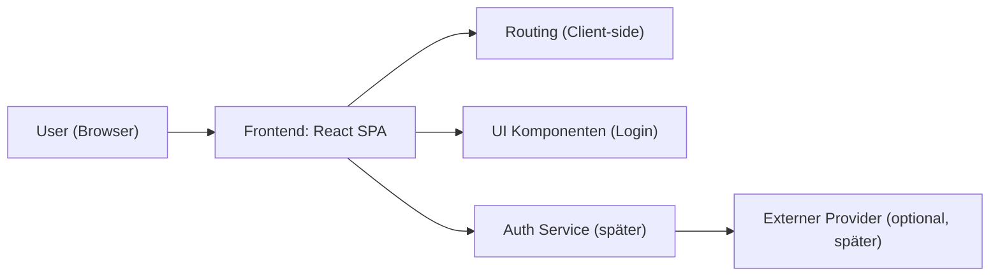

## 1. Architekturdesign

## 2. Technologiebeschreibung
- Frontend: React@18 + TypeScript + Vite
- Styling: CSS Modules + CSS Variablen (Brand-Farben, Abstände, Radius, Schatten)
- Routing: React Router (vorbereitet, auch wenn Phase 1 nur /login rendert)
- Backend: Keins in Phase 1 (Formular-Submit als UI/Mock)
- Datenhaltung: Keine in Phase 1

## 3. Routendefinitionen
| Route | Zweck |
|------|------|
| / | Redirect auf /login |
| /login | Login-Seite gemäß Designvorlage (Phase 1 Implementierung) |
| /app | Geschützter Bereich (Platzhalter/Später) |

## 4. API-Definitionen
Kein Backend in Phase 1. Für die UI wird ein Mock-Flow genutzt:
- Client-seitige Validierung (z. B. required, E-Mail Format)
- Optional: simuliertes Login (Success/Failure) für Interaktionszustände

## 5. Server-Architekturdiagramm
Nicht anwendbar (kein Backend in Phase 1).

## 6. Datenmodell
Nicht anwendbar (kein persistentes Datenmodell in Phase 1).
